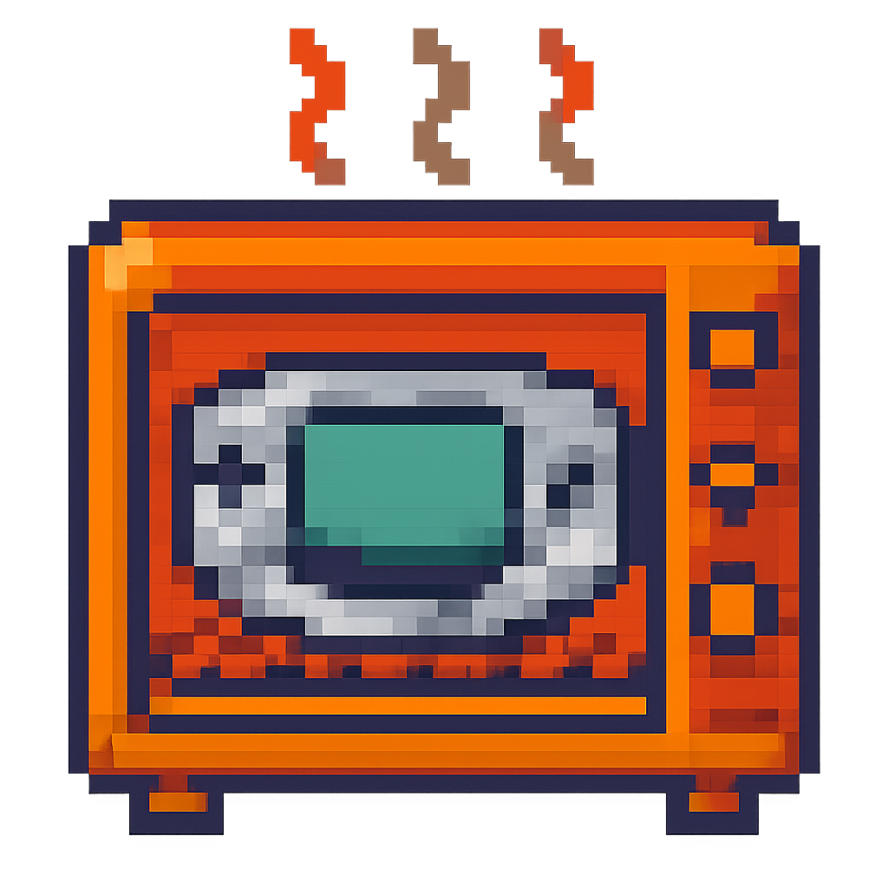
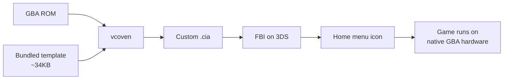
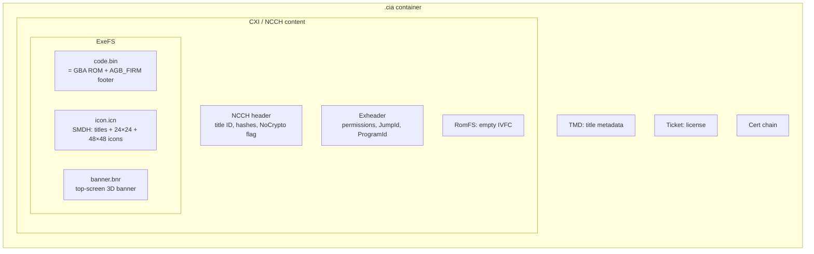
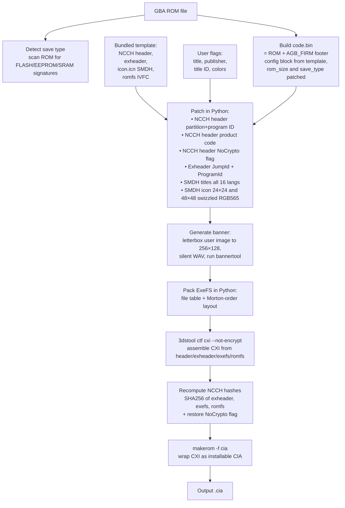

# vcoven

## macOS drag-and-drop app

The native SwiftUI app accepts one or more `.gba` files, 48×48 icon art, and
256×128 banner art. Its two-column editor provides live 3DS previews plus title,
publisher, title ID, product code, and save-type controls. Each `.cia` is written
next to its source ROM. It bundles no Python runtime, Pillow, or Rosetta-only tool.

```bash
./scripts/build-macos-app.sh
open dist/vcoven.app
```

The conversion core remains portable. The current SwiftUI shell targets macOS;
Windows and Linux need their own small UI shell plus platform builds of
`makerom` and `3dstool`.

The bundled `3dstool` is compiled from the upstream v1.2.6 source as native
Apple Silicon code with OpenSSL linked statically. Rebuild it with:

```bash
brew install cmake openssl@3
./scripts/build-3dstool-arm64.sh
```

<p align="center">
  
</p>

> *Bake your own GBA Virtual Console titles for the Nintendo 3DS. CLI tool, no donor required, no Wine, no Docker.*

> Don't want to install anything? There's also a **web version** at **[vcoven.com](https://vcoven.com)** — same build pipeline behind a Cloud Run backend, with optional QR-code install for FBI. Handy for one-off builds or non-Mac/Linux users. (Still alpha; see the banner.)

## Supported platforms

| Platform | v0.1 status |
|----------|-------------|
| **macOS Apple Silicon** (arm64) | ✅ stable — primary target, fully tested end-to-end |
| **Linux x86_64** | ⚠️ experimental — installs via the same `brew tap`, builds prebuilt in CI but not battle-tested. File an issue if you hit problems. |
| macOS Intel (x86_64) | ❌ not in v0.1 — GitHub deprecated Intel macOS CI runners. Tracked for v0.2 via PyPI distribution. |
| Linux ARM (aarch64) | ❌ not in v0.1 — upstream tools don't ship ARM Linux binaries. Tracked for v0.2. |
| Windows | ❌ not in v0.1 — needs PyPI/Scoop distribution. Tracked for v0.2. |

`vcoven` builds installable Game Boy Advance Virtual Console CIA files from `.gba` ROMs on macOS. Drop in a ROM, get a CIA. Install with FBI on a hacked 3DS, and the game appears as its own home menu icon — running on the 3DS's actual GBA hardware (every 3DS has a real GBA chip inside).

```bash
brew tap vedoot/vcoven
brew install vcoven

vcoven build my-game.gba \
  --title "My GBA Game" \
  --publisher "Independent Developer" \
  --title-id 0004000000F00100 \
  --product-code CTR-N-MGB1 \
  --icon icon.png \
  --banner banner.png \
  -o my-game.cia
```

That's it. Transfer `my-game.cia` to your 3DS, install with FBI, profit.

---

## Why this exists

The 3DS has a real GBA processor inside. When you launch a Virtual Console GBA title, the 3DS soft-reboots into AGB_FIRM and hands control to that hardware — the result is **pixel-perfect GBA emulation**, indistinguishable from a real GBA, with better battery life and a brighter screen.

To get an arbitrary `.gba` ROM running this way, you need a **GBA VC inject** — a `.cia` file built from a GBA ROM, packaged with the right metadata so the 3DS treats it as a Virtual Console title.

The standard tool for this is **NSUI (New Super Ultimate Injector)**:
- Windows-only GUI app
- No source code released
- Doesn't run cleanly under Wine on macOS
- Requires the user to dump their own donor CIA

The community alternatives are either Docker-based (heavy), require devkitARM toolchains (heavier), or are abandoned. **No clean Mac-native CLI existed.** This project is that, plus it ships with a sanitized template baked in so most users don't even need to dump a donor.

---

## What it does (high level)



You provide:
1. A `.gba` ROM
2. A title, publisher, and a few cosmetic settings (colors)

You get back:
- A `.cia` file with your ROM, your title, and your custom icon and banner
- Installable with any 3DS CIA installer
- Launches into AGB_FIRM and runs your ROM on the 3DS's native GBA hardware

The bundled template (`template/`) contains ~34 KB of structural NCCH bytes — the minimum needed to build a valid GBA VC inject. **No copyrighted game content (ROMs, icons, banners, audio, or Nintendo art) is included.** See the [legal note](#legal-notes) below for details.

---

## How it works (architecture)

A 3DS CIA file is a layered container. To inject a GBA ROM, vcoven assembles a CXI from the bundled template plus the user's ROM, swapping in patched headers, fresh icons, a generated banner, and a freshly-built ExeFS.



The pipeline vcoven runs for each ROM:



---

## Installation

### Via Homebrew (recommended)

```bash
brew tap vedoot/vcoven
brew install vcoven
```

This installs `vcoven` to `/opt/homebrew/bin/vcoven` on macOS (Apple Silicon) or `/home/linuxbrew/.linuxbrew/bin/vcoven` on Linux, with all dependencies bundled.

### Manual install (development / Linux)

```bash
git clone https://github.com/vedoot/vcoven
cd vcoven
brew install p7zip cmake libpng libogg libvorbis
pip3 install --break-system-packages Pillow

# Download tool binaries — see homebrew/README.md for the URLs
mkdir -p tools
# ... fetch makerom, ctrtool, 3dstool, and build bannertool ...

python3 vcoven.py info   # verify all tools are found
```

---

## Usage

### Build a single ROM

```bash
vcoven build my-game.gba \
  --title "My GBA Game" \
  --long-title "My GBA Game (Long Description)" \
  --publisher "Independent Developer" \
  --title-id 0004000000F00100 \
  --product-code CTR-N-MGB1 \
  --icon examples/art/sample_icon.png \
  --banner examples/art/sample_banner.png \
  -o my-game.cia
```

Required flags:
- `--title` — short display name (shown under the home menu icon)
- `--title-id` — 16 hex digits. Pick something in an unused range (e.g. `0004000000F00X00`) so you don't collide with installed titles.
- `--icon` — path to a square-ish image (PNG/JPG). Auto-cropped and resized to 24×24 and 48×48.
- `--banner` — path to a banner image (any aspect). Letterboxed onto a 256×128 canvas for the top-screen banner.

Optional:
- `--long-title` — full description (defaults to `--title`)
- `--publisher` — publisher string (defaults to "Homebrew")
- `--product-code` — internal code, max 16 chars (defaults to "CTR-N-HMBW")
- `--save-type` — `auto` (default), `flash1m`, `flash512`, `eeprom8`, `eeprom64`, `sram`, `none`

### Build many at once

Drop a TOML config at `examples/batch.toml` and run:

```bash
vcoven batch examples/batch.toml
```

See `examples/batch.toml` for a template — one `[[game]]` block per ROM.

### Other commands

```bash
vcoven info                  # Show paths and tool versions
vcoven setup donor.cia       # Optional: extract a custom donor (advanced)
vcoven build ... --use-donor # Use the user-extracted donor instead of the
                             # bundled template
```

---

## The bugs we hit (the actually-useful part of this README)

Building this from scratch took hours of debugging because **none of these gotchas are documented anywhere**. Recording them here so the next person doesn't suffer.

### Bug 1: 3dstool doesn't recompute NCCH hashes on repack

The NCCH header (the outermost layer of a CXI) contains SHA256 hashes of the Exheader, ExeFS, and RomFS regions. When you modify any of these and ask `3dstool -ctf cxi` to repack, **it uses the input header file verbatim — it does NOT recompute the hashes.** The result is a CXI whose stored hashes don't match the actual content. The 3DS rejects this on install with `0xD8E08025` ("Invalid NCCH" from the AM module).

**Fix:** After 3dstool repacks the CXI, open the resulting file in Python, recompute the SHA256s of the Exheader/ExeFS/RomFS regions, and overwrite the hash fields in the NCCH header at offsets 0x160, 0x1C0, and 0x1E0.

### Bug 2: NoCrypto flag stripped + 3dstool encrypts during repack

Donor GBA VC CIAs have the **NoCrypto bit (0x04) set in NCCH flags byte 0x18F**, indicating the content is unencrypted. When 3dstool repacks the CXI with the donor's header file:

1. It **strips the NoCrypto flag** from the header
2. It **encrypts the exheader/exefs anyway** using the title key
3. The result is a CXI marked as "encrypted" with garbage content

The 3DS can't decrypt it (the title isn't in the keystore), and AM rejects with `0xD8E08025`.

**Fix:**
1. Set NoCrypto bit in the NCCH header *before* passing it to 3dstool
2. Pass `--not-encrypt` to `3dstool -ctf cxi` — this is critical and not in the default options
3. Restore the NoCrypto bit in the final CXI after hash recompute (3dstool clears it again on output)

### Bug 3: Partition ID at 0x108 was still pointing to the donor's title ID

NCCH headers have **two title-ID-like fields**:
- `partitionId` at 0x108
- `programId` at 0x118

The home menu uses **partition ID** for title lookup. If you patch only `programId`, the home menu finds the title but trips over the mismatch and crashes when displaying or launching it.

**Fix:** Patch both 0x108 and 0x118 with the new title ID. We discovered this from a Luma3DS crash dump that showed the `menu` (home menu) process was the one crashing.

### Bug 4: JumpId in exheader still pointing to donor

The exheader has a `JumpId` field at offset **0x1C8** in the SCI section. This is the title ID the OS jumps to when launching a title. If left as the donor's title ID, the home menu reads it, tries to launch the donor (which has been deleted from the system because we replaced it with our inject), fails to find it, and reports **"the SD card was removed"** — an ErrDisp error, not even a crash dump.

This bug took the longest to find because the error is misleading: the SD card is fine, the title ID lookup is what failed.

**Fix:** Patch exheader 0x1C8 with the new title ID.

### Bug 5: Don't patch the Access Descriptor at 0x600

The exheader is laid out as:
- 0x000-0x200: System Control Info (SCI) — contains JumpId
- 0x200-0x400: ARM11 Local System Capabilities (ACI) — contains program ID
- 0x400-0x800: **Access Descriptor (AD)** — RSA-2048 signed by Nintendo

The AD at 0x400 is signed and contains a *mirror copy* of the ACI at AD-offset 0x200 (which is exheader-offset 0x600). It's tempting to patch the program ID there too for consistency.

**Don't.** The AD signature covers AD-offset 0x100 onwards. Modifying any byte after that invalidates the signature. CFW like Luma3DS *usually* tolerates SCI/ACI/AD program ID mismatches, but invalidating the signature is a separate failure mode that produces hard-to-diagnose crashes.

**Fix:** Patch the SCI program ID at 0x200, leave the AD at 0x600 alone.

---

## AGB_FIRM footer construction

The 3DS GBA Virtual Console launcher (AGB_FIRM) reads a small footer appended to the GBA ROM inside `code.bin`. The footer tells AGB_FIRM the ROM size, save type, sleep button mask, and color correction LUT.

Layout in `code.bin`:

```
+----------------------------------+ offset 0
|                                  |
|         GBA ROM (4-32 MB)        |  ← variable size
|                                  |
+----------------------------------+ offset rom_size
|                                  |
|     Config block (0x324 bytes)   |
|     - 0x004: rom_size            |
|     - 0x008: save_type           |
|     - 0x00E: sleep_mask          |
|     - 0x024: color LUT (768B)    |
|                                  |
+----------------------------------+ + 0x324
|     Padding (12 bytes)           |
+----------------------------------+
|     Section descriptors          |
|     [0] type=0 (ROM) off=0       |
|         size=rom_size            |
|     [1] type=1 (Config)          |
|         off=rom_size size=0x324  |
+----------------------------------+
|     .CAA header (16 bytes)       |
|     magic=".CAA"                 |
|     version=1                    |
|     section_offset=...           |
|     section_count=2<<4           |
+----------------------------------+ EOF
```

vcoven keeps the template's config block (LUT, sleep mask, save performance settings) and only updates `rom_size` and `save_type` for the new ROM. The save type is auto-detected by scanning the ROM for save signature strings (`EEPROM_V`, `FLASH1M_V`, `FLASH512_V`, `SRAM_V`).

---

## SMDH icon swizzling

3DS SMDH icons are stored in **swizzled RGB565** — 8×8 tiles in raster order, with pixels *within* each tile arranged in **Morton (Z-order) sequence**.

```
Tile arrangement (48×48 = 6×6 tiles):
+----+----+----+----+----+----+
| T0 | T1 | T2 | T3 | T4 | T5 |
+----+----+----+----+----+----+
| T6 | T7 | T8 | T9 |T10 |T11 |
+----+----+----+----+----+----+
| ...                          |

Within each 8×8 tile, Morton order:
 0  1  4  5 16 17 20 21
 2  3  6  7 18 19 22 23
 8  9 12 13 24 25 28 29
10 11 14 15 26 27 30 31
32 33 36 37 48 49 52 53
34 35 38 39 50 51 54 55
40 41 44 45 56 57 60 61
42 43 46 47 58 59 62 63
```

Each pixel is RGB565 little-endian (2 bytes). vcoven loads the user's icon image with PIL, center-crops to square, resizes to 24×24 and 48×48, then runs it through a swizzler to produce the bytes the 3DS expects.

---

## Legal notes

The bundled `template/` directory contains a small set of structural bytes (~34 KB total) extracted from a Game Boy Advance Virtual Console title. Specifically:

| File | Size | What it is |
|------|------|------------|
| `ncchheader.bin` | 512 B | NCCH header structure (title IDs and hashes zeroed — vcoven patches these). Signature region preserved as required by the launcher. |
| `exheader.bin` | 2048 B | Exheader: ARM11 capability descriptor + signed Access Descriptor (the GBA VC permission template) |
| `icon.icn` | 14016 B | SMDH structural shell (titles and icon images zeroed out — vcoven fills them in) |
| `logo.darc.lz` | 8192 B | The Nintendo "GAME BOY ADVANCE" boot animation. Required by the AGB_FIRM launcher; without it the title won't boot. |
| `romfs.bin` | 16384 B | Empty IVFC romfs container |
| `config_block.bin` | 804 B | AGB_FIRM color LUT and save performance settings |

**No copyrighted game content is included** — no ROM data, no game-specific icon art, no game-specific banner art, no audio, no game text. We zero out every cosmetic field that vcoven patches anyway.

There are two legally-gray bits in the bundle:

1. **The RSA signature inside `exheader.bin`'s Access Descriptor** — 256 bytes generated by Nintendo's keys. CFW like Luma3DS bypasses the signature check at runtime, so it functions as compatibility padding.

2. **`logo.darc.lz`** (8 KB) — the "GAME BOY ADVANCE" boot animation that plays when launching any GBA VC title. We bundle this so injects feel native (you get the same boot animation as a real GBA cart). The launcher requires it to be present; without it, titles don't boot.

This is the same gray zone NSUI and every other 3DS injector tool lives in.

If you are a copyright holder and believe these bytes should not be included, please open an issue and we'll address it.

You bring your own ROMs. vcoven does not distribute or facilitate the download of copyrighted game files.

---

## Roadmap

**v0.2 (planned):**
- [ ] **macOS Intel** support (via universal binary build or PyPI distribution)
- [ ] **Linux ARM (aarch64)** support — requires building all 4 tools from source on ARM CI
- [ ] **Windows x86_64** support — distribute as a PyPI package and/or Scoop manifest
- [ ] **PyPI distribution** (`pip install vcoven`) — universal install command across all platforms

**Later:**
- [ ] **Animated banners** — currently the banner is a static PNG wrapped in CGFX. Real Nintendo banners have rotation/animation keyframes baked into the CGFX. Doable via surgical CGFX texture swap.
- [ ] **Custom audio** in the banner (currently silent WAV)
- [ ] **Region/language-specific titles** (currently all 16 SMDH slots get the same English text)
- [ ] **Save data import** from emulator `.sav` files
- [ ] **RSF-based scratch build** — eliminate the donor template entirely by constructing the NCCH from scratch with `makerom`'s RSF format

---

## Changelog

See [`CHANGELOG.md`](CHANGELOG.md) for notable changes to the CLI and web stack.

## Acknowledgments

- **3DSGuy** for `makerom` and `ctrtool`
- **dnasdw** for `3dstool`
- **carstene1ns** and **Steveice10** for `bannertool`
- **profi200** for `open_agb_firm` (the docs that exist for the AGB_FIRM footer format)
- **3dbrew.org** for the NCCH/CXI/SMDH format references
- The 3DS homebrew scene at large for keeping this hardware alive a decade after launch

## License

MIT for vcoven itself. See `LICENSE` for details and bundled binary licenses.
